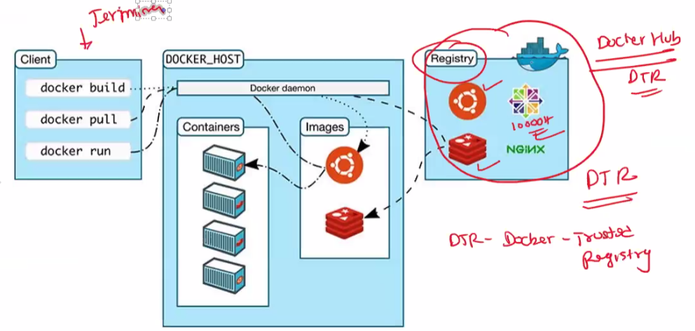
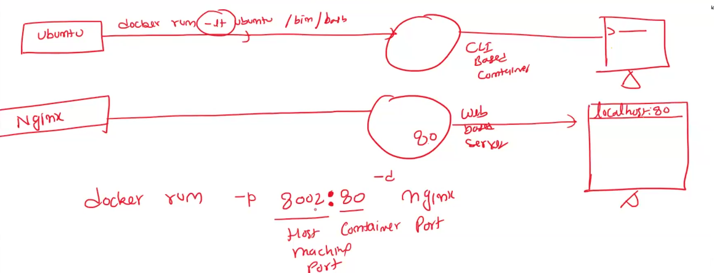
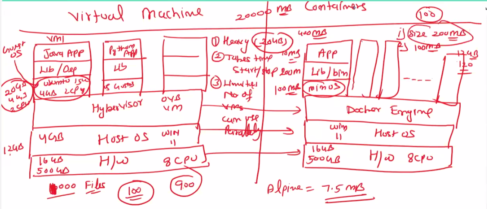
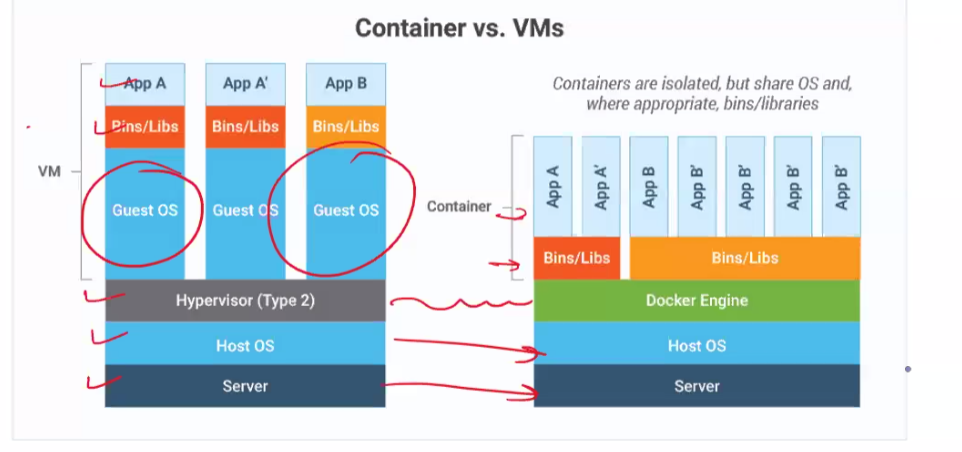
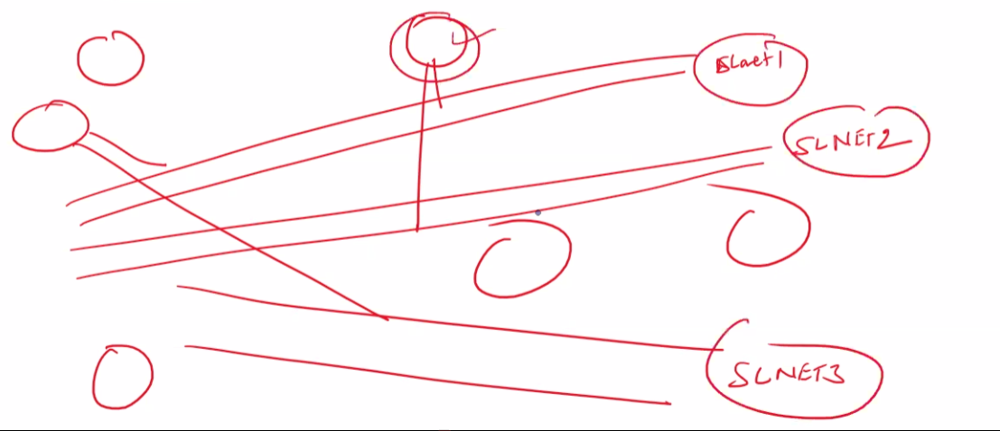
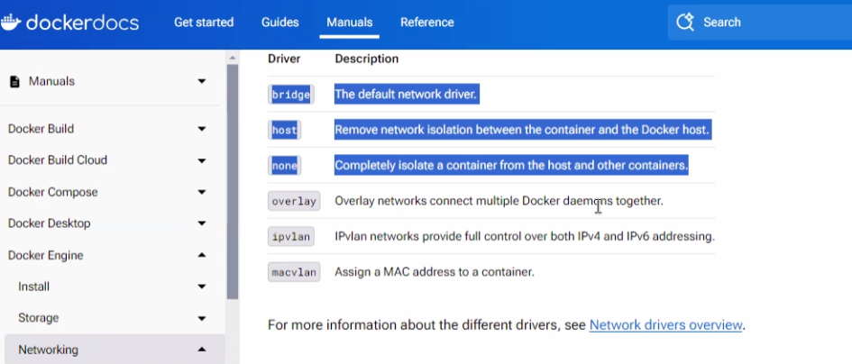
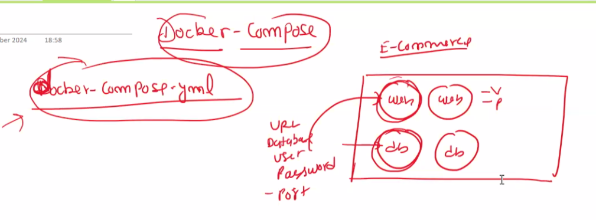

# Docker
This repo contains the learnings of Docker

https://docs.docker.com/engine/install/ubuntu/

https://docs.docker.com/desktop/install/windows-install/

docker images
docker image ls
docker run = pull + create

docker pull ubuntu
docker pull nginx

DTR: Docker Trusted Registry
where all the docker images are available

docker images (all downloded images)
docker pull <image-name>
docker rmi <Image-name>

docker run <image-name>
 docker run -it ubuntu   
 
 -it means interactive terminal

 docker ps
 shows the running containers

 docker ps -a (all running and stopped container)

docker rmi -f nginx (this will forcefully delete the images without worring about the continers refering this image)

Containers is an instance of docker image

docker rm <container-id>

docker stop <container-id>
docker start <container-id>

container take space from Ram
Images takes space from hard disk

docker start container-id

docker run will always create  a new continer

docker exec -it <container-id>

Docker Container Commands

 

1. docker run <image-name>

   docker run -it ubuntu

2. docker ps (running container)

3. docker ps -a (all running and stopped container)

4. docker rm <cont-id>

5. docker stop <cont-id>

6. docker start <cont-id>

7. docker exec -it <cont-id> /bin/bash

delete all containers

docker ps -aq

The following need to be executed in git gitbash for windows
docker rm -f $(docker ps -aq)

docker run -p 8002:80 -d nginx

Cli based container vs Web Based Container

docker inspect anil_container

docker stats   

Day2

Containers vs Virtual Machines
Build your own Docker image
Tag and image 
Registry (Repository where you can add your docker image)
local vs Remote Repository(Dockerhub)

Apphine is an OS whose size is 7.5 mb

Container size is way less than the actual VM size

Guest OS for VM
Minimum OS for Containers

Responsibility of developer or deveops engineer to make the docker image.

C:\Users\sathi>docker run -d -p 8009:80 nginx
7e2ac4cd21330cc534531312e0d329a7eaab968809333bbb0a5a5110d13df684

C:\Users\sathi>docker exec -it 7e2ac4cd2 /bin/bash
root@7e2ac4cd2133:/# ls
bin   dev                  docker-entrypoint.sh  home  lib64  mnt  proc  run   srv  tmp  var
boot  docker-entrypoint.d  etc                   lib   media  opt  root  sbin  sys  usr
root@7e2ac4cd2133:/# cd usr/share/nginx/html
root@7e2ac4cd2133:/usr/share/nginx/html# ls
50x.html  index.html
root@7e2ac4cd2133:/usr/share/nginx/html# docker images
bash: docker: command not found
root@7e2ac4cd2133:/usr/share/nginx/html# exit
exit

What's next:
    Try Docker Debug for seamless, persistent debugging tools in any container or image → docker debug 7e2ac4cd2
    Learn more at https://docs.docker.com/go/debug-cli/

C:\Users\sathi>docker images
REPOSITORY           TAG       IMAGE ID       CREATED       SIZE
hkshitesh/slwebapp   1.0       4906945f1933   5 days ago    192MB
ubuntu               latest    dc4c1391d370   8 days ago    78.1MB
nginx                latest    7f553e8bbc89   2 weeks ago   192MB
memcached            latest    a783d40c8b80   5 weeks ago   84.8MB

C:\Users\sathi>cd C:\Repos

C:\Repos>cd myapp

C:\Repos\MyApp>docker build -t slwebapp .
[+] Building 0.7s (8/8) FINISHED                                             docker:desktop-linux
 => [internal] load build definition from Dockerfile                                         0.0s
 => => transferring dockerfile: 99B                                                          0.0s
 => [internal] load metadata for docker.io/library/nginx:latest                              0.0s
 => [internal] load .dockerignore                                                            0.0s
 => => transferring context: 2B                                                              0.0s
 => [1/3] FROM docker.io/library/nginx:latest                                                0.2s
 => [internal] load build context                                                            0.1s
 => => transferring context: 562B                                                            0.0s
 => [2/3] WORKDIR /usr/share/nginx/html                                                      0.0s
 => [3/3] COPY . .                                                                           0.1s
 => exporting to image                                                                       0.1s
 => => exporting layers                                                                      0.0s
 => => writing image sha256:9f65c28c529b14313c44bb1b7ff818c758eaac826641a26ccc5d411f15b53ef  0.0s
 => => naming to docker.io/library/slwebapp                                                  0.0s

View build details: docker-desktop://dashboard/build/desktop-linux/desktop-linux/qwn4vbyzgzdnh7xd1qotbqo1o

What's next:
    View a summary of image vulnerabilities and recommendations → docker scout quickview

C:\Repos\MyApp>docker images
REPOSITORY           TAG       IMAGE ID       CREATED          SIZE
slwebapp             latest    9f65c28c529b   59 seconds ago   192MB
hkshitesh/slwebapp   1.0       4906945f1933   5 days ago       192MB
ubuntu               latest    dc4c1391d370   8 days ago       78.1MB
nginx                latest    7f553e8bbc89   2 weeks ago      192MB
memcached            latest    a783d40c8b80   5 weeks ago      84.8MB

C:\Repos\MyApp>docker run -d -p 8002:80 slwebapp
00d1826b98e7b4452c1843031d8b89a52a3a9d465ec194318627f680ccc65f9c

C:\Repos\MyApp>docker tag 9f65c28c529b 27349816v/slwebapp:1.0

C:\Repos\MyApp>docker login
Authenticating with existing credentials...
Login Succeeded

C:\Repos\MyApp>docker push 27349816v/slwebapp:1.0
The push refers to repository [docker.io/27349816v/slwebapp]
fec7e04ad455: Pushed
5f70bf18a086: Mounted from hkshitesh/slwebapp
825fb68b6033: Mounted from hkshitesh/slwebapp
7619c0ba3c92: Mounted from hkshitesh/slwebapp
1c1f11fd65d6: Mounted from hkshitesh/slwebapp
6b133b4de5e6: Mounted from hkshitesh/slwebapp
3d07a4a7eb2a: Mounted from hkshitesh/slwebapp
756474215d29: Mounted from hkshitesh/slwebapp
8d853c8add5d: Mounted from hkshitesh/slwebapp
1.0: digest: sha256:ef5b9a8b208277f62bcd1511ff080c2e5aa81e800cdd58215cc1e3f013a507bd size: 2191

C:\Repos\MyApp>docker run -d -p 8004:80 27349816v/slwebapp:1.0
e6f494658c399265af9c46822b6d14ad2034d1a0cc0bd29ab0dd4844939bb230

Network 

Docker Network ls

Docker Network create slnet

docker network inspect slnet

docker run -it --name ubuntu1 --network slnet ubuntu /bin/bash

docker run -it --name ubuntu2 --network slnet ubuntu /bin/bash

apt-get update -y
apt-get install -y iputils-ping

docker run -dit --name container1 --network my_bridge busybox
docker run -dit --name container2 --network my_bridge busybox

